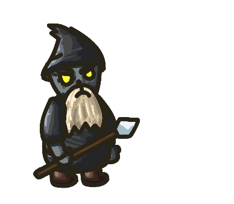

# Available monsters is the game

## Scorpion

### ID: 1

Health | Speed | Gold when killed
:---: | :---: | :---:
0 | 0 | 0

## Mage

### ID: 2

Health | Speed | Gold when killed
:---: | :---: | :---:
0 | 0 | 0

## Ogre With Mallet

### ID: 3

Health | Speed | Gold when killed
:---: | :---: | :---:
0 | 0 | 0

## Science Knight

### ID: 4

Health | Speed | Gold when killed
:---: | :---: | :---:
0 | 0 | 0

## Ogre Knight

### ID: 5

Health | Speed | Gold when killed
:---: | :---: | :---:
0 | 0 | 0

## Fool Knight

### ID: 6

Health | Speed | Gold when killed
:---: | :---: | :---:
0 | 0 | 0

## Blue Ogre

### ID: 7

Health | Speed | Gold when killed
:---: | :---: | :---:
0 | 0 | 0

## Stone Child

### ID: 8

Health | Speed | Gold when killed
:---: | :---: | :---:
0 | 0 | 0

## Flying Ninja

### ID: 9

Health | Speed | Gold when killed
:---: | :---: | :---:
0 | 0 | 0

## Stone Giant

### ID: 10

Health | Speed | Gold when killed
:---: | :---: | :---:
0 | 0 | 0

